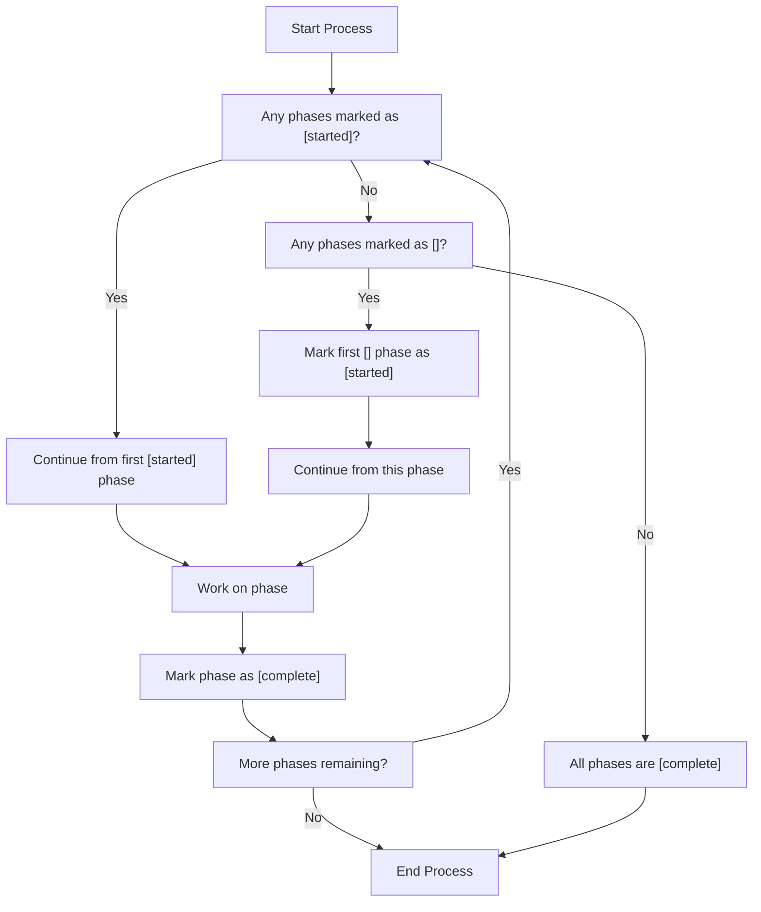
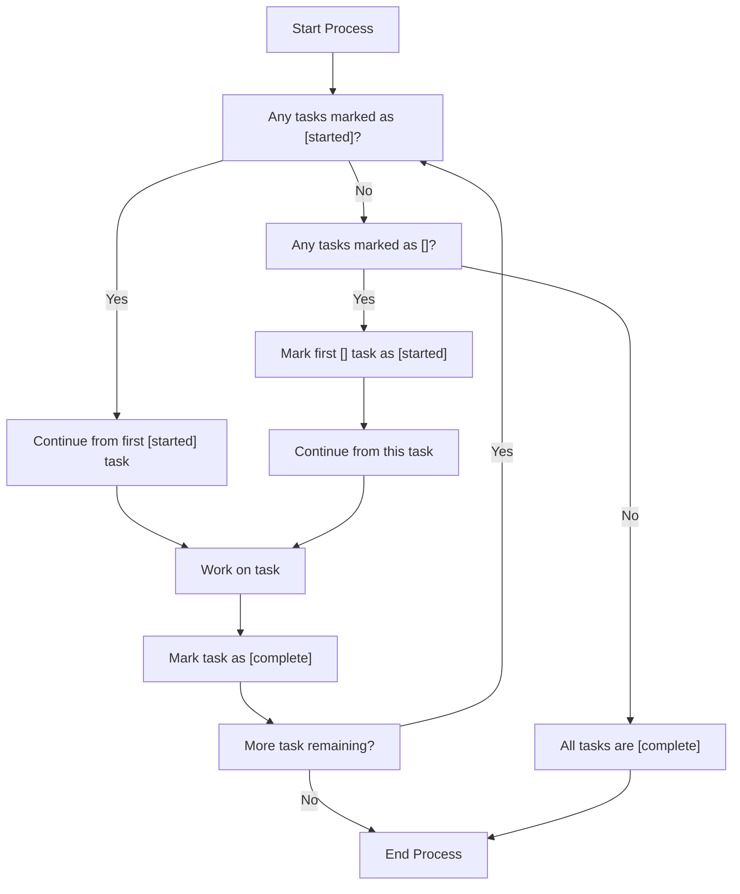

# Project

Extraction of API Client from Application Source Code found in `./app`

API In question:

* api-us.vicohome.io

Based on extensive review of the codebase and its usage of the API, we will begin to catalog these remote endpoints in OpenAPI spec files.

## Project Orchestration

We break things down into phases with tasks. Phases can have these states:

* []
* [started]
* [complete]

When we open the project up, we look for the first phase that is marked as [started]. We then review its tasks. Upon completion of all tasks, we mark the phase as [completed]. If there are none marked as [started], we look for the first one marked as []. We update it to [started].

Likewise, tasks within these phases can have statuses:

* []
* [started]
* [complete]

When we enter a [started] phase, we iterate through the tasks looking for the first one that is marked [started]. Upon completion of the task, we mark it as [completed]. If there are none marked as [started], we look for the first one marked as []. We update it to [started].

# Phase One [complete] Research API

1. [complete] Create `endpoints.yml` that contains a list of all known endpoints. We create a grouped inventory of endpoints. Each new category has some added metadata about its analysis state. For now, our state is "unverified". Each new endpoint added has metadata accounting for its analysis state. For now, our state is "unverified"

2. [complete] Verify endpoints in `endpoints.yml`. Here we look for the first api group that states it is "unverified". We will then search for the first api endpoint under that group that is "unverified". We will do deep analysis of the code found in `/app` for any and all information about how this endpoint is called, what parameters are being sent, what is being obtained as a result of the request, and whether any error handling is occurring. With what we learn about the endpoint during this evaluation, we create a special markdown file inside of the `endpoints/` folder in the form of `${nice-endpoint-name}-discovery.md`. When a group has endpoints who's statuses are all `openapi`, we may mark the group as `openapi`.

3. [complete] Form our OpenAPI docs. We will review the contents of `endpoints.yml` and identify the first one that is marked as "verified". We will find the corresponding research information about this endpoint in `${nice-endpoint-name}-discovery.md`. With this information we will create the appropriate `paths` and `components` entries necessary to properly add this endpoint to our OpenAPI spec. The endpoint entry also contains a `file` field. This will be like `account.yml`, `device.yml`, `payment.yml`, `library.yml`, etc. these files are for that apigroup's OpenAPI yaml. Once we know what we will place in `<apigroup>.yml`, we will add the necessary `paths` and `components` updates for our endpoint. After doing this, we can update the entry for our endpoint in `endpoints.yml` to now state `openapi`.

# Phase Two [complete] Stitch OpenAPI Spec Together

1. [complete] We have several separate OpenAPI Specs contained in `account.yml`, `device.yml`, `location.yml`, `notification.yml`, `ai.yml`, `vip.yml`, and `payment.yml`. We must form these all into a single OpenAPI spec named `openapi.yml`. For tracking progress on this task you have access to an `openapis.yml` file. It maintains a consistent reference to the target file, `openapi.yml`, and the children files we're pulling from. When you open `openapis.yml`, look for the first child openapi spec that has a tag of [started]. If there is not one marked [started], find the first one marked [] and set it to [started]. Once you have a handle on what child openapi spec you are working on, move its relevant content over to `openapi.yml`. Also be sure you carry over and dediplicate any components of the resources youve carried over- we have a lot of request and response objects to reason about. Once that openapi spec is properly merged in and components are reconciled, we may mark the entry in `openapis.yml` as [completed].

# Phase Three [] Generate API Client

1. [] Now that we have a complete OpenAPI spec in `openapi.yml`, let's generate clients for various programming languages. We'll use the OpenAPI Generator CLI to generate clients for JavaScript, Python, and Java. For each language, we'll create a new directory under `/clients` and generate the client there.